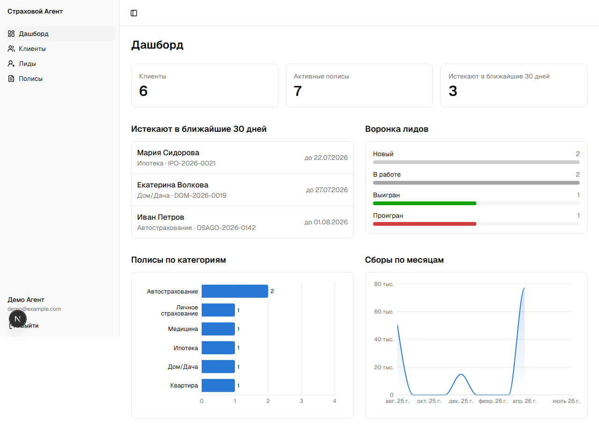
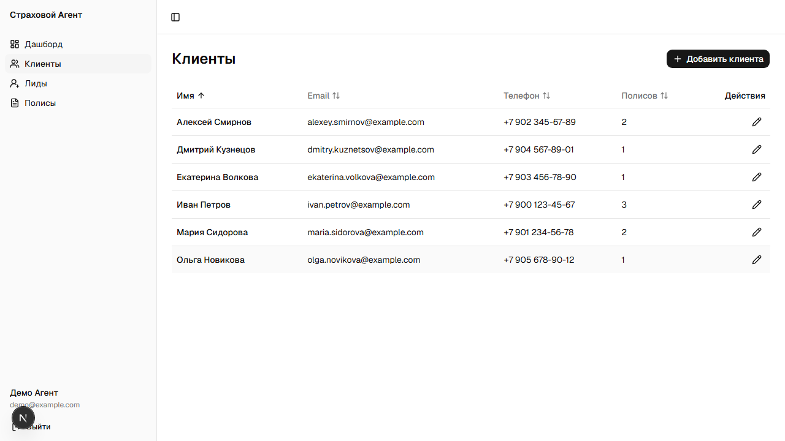
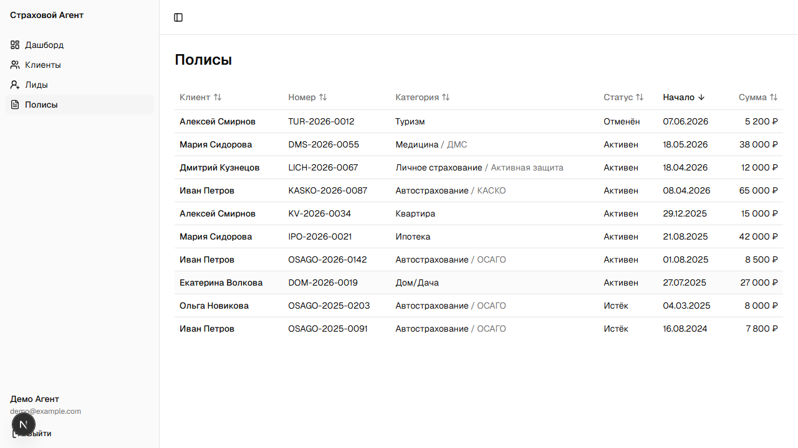
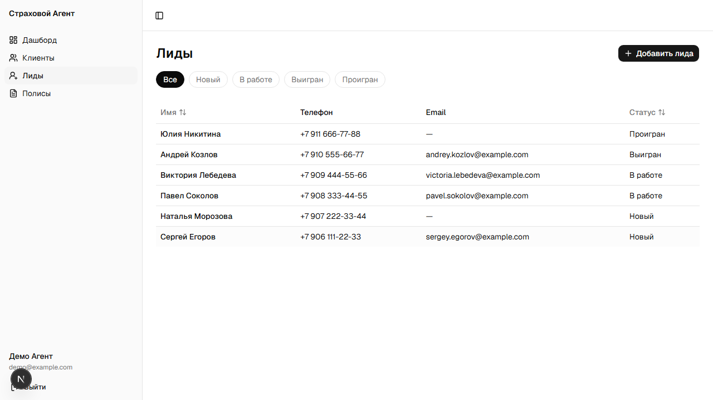

# Страховой Агент — CRM для страхового агента

Pet-проект: CRM-система для частного страхового агента — учёт клиентов, полисов и лидов (потенциальных клиентов) в одном месте, с дашбордом по ключевым показателям.

> 🔗 Демо: [insurance-nine-mu.vercel.app](https://insurance-nine-mu.vercel.app/)
> Логин для демо-доступа: `demo@example.com` / `demo12345`

## Скриншоты

| Дашборд | Клиенты |
|---|---|
|  |  |

| Полисы | Лиды |
|---|---|
|  |  |

## Возможности

- **Аутентификация** — регистрация/вход/выход на собственной cookie-сессии (без сторонних auth-провайдеров)
- **Клиенты** — CRUD, привязанные полисы прямо на странице клиента
- **Полисы** — CRUD с категориями/подтипами страхования, статусами (активен/истёк/отменён), суммой и сроком действия
- **Лиды** — воронка по статусам (новый / в работе / выигран / проигран) с фильтрами и сортировкой, конвертация лида в клиента одним действием
- **Дашборд** — количество клиентов, активных полисов, полисы, истекающие в ближайшие 30 дней, воронка лидов, распределение полисов по категориям и динамика сборов по месяцам (графики на Recharts)
- **Изоляция данных** — у каждого агента (пользователя) свои клиенты, полисы и лиды; доступ к чужим записям невозможен даже по прямой ссылке

## Стек технологий

- **[Next.js 16](https://nextjs.org)** (App Router, Server Actions, Turbopack)
- **React 19**
- **TypeScript**
- **Prisma 7** + **PostgreSQL** ([Neon](https://neon.tech))
- **Tailwind CSS v4**
- **[base-ui](https://base-ui.com) / shadcn** — компоненты интерфейса
- **[Recharts](https://recharts.org)** — графики на дашборде
- **Zod** — валидация форм
- Собственная аутентификация: `scrypt` для паролей (`node:crypto`) + подписанная HMAC сессионная кука — без сторонних auth-библиотек

## Архитектура проекта

Структура по мотивам Feature-Sliced Design:

```
src/
├── app/              # Next.js роуты (App Router)
│   ├── (auth)/       # login, signup — без сайдбара
│   └── (app)/        # клиенты, полисы, лиды, дашборд — за сайдбаром
├── features/         # бизнес-логика по фичам (clients, policies, leads, auth)
│   └── <feature>/
│       ├── api/      # server actions
│       ├── model/    # zod-схемы, типы, константы
│       └── ui/       # компоненты форм
├── widgets/          # составные UI-блоки (сайдбар приложения)
├── shared/           # переиспользуемые lib/ui, не привязанные к конкретной фиче
└── proxy.ts          # аналог middleware.ts в этой версии Next.js — защита роутов
```

## Локальный запуск

1. Клонировать репозиторий и установить зависимости:

   ```bash
   npm install
   ```

2. Создать `.env` на основе `.env.example` и указать:
   - `DATABASE_URL` — строка подключения к PostgreSQL (например, из [Neon](https://neon.tech))
   - `SESSION_SECRET` — любая длинная случайная строка

3. Накатить схему БД:

   ```bash
   npx prisma migrate dev
   ```

4. (опционально) Наполнить базу демо-данными — создаст демо-пользователя `demo@example.com` / `demo12345` с клиентами, полисами и лидами:

   ```bash
   npm run db:seed
   ```

   ⚠️ Скрипт полностью очищает таблицы пользователей/клиентов/полисов/лидов перед заполнением — не запускать на базе с реальными данными, которые жалко потерять.

5. Запустить дев-сервер:

   ```bash
   npm run dev
   ```

   Приложение будет доступно на [http://localhost:3000](http://localhost:3000).
